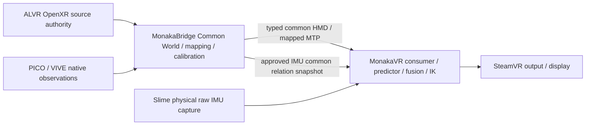

# Phase 2B-5Y: OpenXR-anchored Monaka Common World authority

2026-10-09. **PASS — OPENXR-ANCHORED MONAKA COMMON-WORLD AUTHORITY DESIGNED / IMPLEMENTATION DEFERRED**.

選定は **M2 / B1 (ALVR → MonakaBridge → MonakaVR)** のみ。これはsource-backedな設計の完了であり、live authorityの成立、数値精度、Strong Trusted、physical PASSを意味しない。以下の新しい型・lifecycle・transportはすべてDESIGN-DECISION / NOT IMPLEMENTED。

## 1. 固定したsourceとclaim分類

| Receipt | 固定値 / 観測 |
|---|---|
| Monaka production | `feature/raw-hmd-provider-transport` / `744ab4c08f8426d59afacb459314134d7b816b74` |
| Monaka docs checkout | `audit/alvr-openxr-mapping-authority`, 同じbase、production checkoutは変更なし |
| ALVR upstream | `alvr-org/ALVR@e0d83b46168449cb0bb514770dd926b0ed85c55a` |
| ALVR actual prototype | `prototype/monaka-hmd-authority` / `e94ff1967c70da480531c3ec9f6956d3be8b5ce5`, clean |
| MonakaBridge actual | `refactor/monaka-layer-separation` / `84f5b7529694d19aee98461580f3cfe628bf3cbc`, clean、planning-timeと一致 |
| Monaka OpenVR pin | `91825305130f446f82054c1ec3d416321ace0072` (`bindings-provider/openvr` gitlinkおよび5S driver-audit tree) |
| ALVR独自OpenVR pin | `0924064316de3effbcd1acf1e309182a2deb1c05`。Monakaのsemantic pinとは区別 |
| Khronos current reference | OpenXR **1.1.63**, release-1.1.63、アクセス2026-10-09 |
| 5S | `feature/direct-6dof-output` / `9a09dd25b4c62a3457d465e7fe0b12c72067a58b`; BLOCKED — PHYSICAL PROBE DEPLOYMENT / STEAMVR RESTART DEFERRED |

再現用path/blob/SHA256とnumbered sourceはworkspaceの `MonakaVR/build/reports/phase2b5y-alvr-openxr-monaka-mapping-authority-20261009/source-receipts.json` / `source-audit-numbered.md`。5X patch/report hash、前後の5S preservation、math結果も同directoryにある。

分類は **SPEC-PROVEN** (規格)、**SOURCE-PROVEN** (固定sourceの実装)、**DESIGN-DECISION** (後続の要件)、**HIL-REQUIRED** (物理的確認待ち)、**UNAVAILABLE** (現在authorityなし)。新しいcontractの存在をSOURCE-PROVENと呼ばない。

### OpenXR semantics — SPEC-PROVEN

OpenXRは右手系、距離はmetres、quaternionはxyzwでunit rotation、poseはrotation→translation。STAGEは床面の矩形中心をoriginとし+Yが上、XZが矩形辺に沿う。Common Worldの `rh_y_up_neg_z_forward` conventionと整合し、axis permutationやscale correctionを追加しない。STAGEの向きをユーザーの現在の向きから再定義しない。VIEWはviewer origin/centroidであり物理IMU原点と同一と推測しない。[Coordinate system §2.18 / reference spaces §7.1](https://registry.khronos.org/OpenXR/specs/1.1-khr/html/xrspec.html#fundamentals-coordinate-system), [XrPosef](https://registry.khronos.org/OpenXR/specs/1.1/man/html/XrPosef.html), [STAGE](https://registry.khronos.org/OpenXR/specs/1.1/man/html/XR_REFERENCE_SPACE_TYPE_STAGE.html).

ReferenceSpaceChangePendingはlocateの評価timeがchangeTime以上となる境界で新frameを適用する。`poseInPreviousSpace`は新natural originを旧natural frameで表す。application offsetsを含まない。poseValid=falseのtransformは未定義なので使用禁止。[ReferenceSpaceChangePending 1.1.63](https://registry.khronos.org/OpenXR/specs/1.1/man/html/XrEventDataReferenceSpaceChangePending.html).

EventsLostはqueue内イベント欠落を示す。永久失効およびfresh XrSession要求は規格そのものではなく5X/5Yの保守policy。[EventsLost 1.1.63](https://registry.khronos.org/OpenXR/specs/1.1/man/html/XrEventDataEventsLost.html).

## 2. Actual 5X audit — SOURCE-PROVEN

| Fact | 実装と境界（ALVR checkout内path） |
|---|---|
| Session | `client_openxr/src/lib.rs:291–318`: XrSessionごとOS-random 128-bit token。process registryは再使用を拒否。entropy failureはauthorityのみunavailable |
| Source space | `client_openxr/src/interaction.rs:654–704`: identity offsetでVIEW/STAGEを作成、VIEW relative to STAGEをsource locate timeで取得。source P/Qにaxis変換なし |
| Generation | `common/src/hmd_authority.rs:171–247`, `client_openxr/src/lib.rs:483–520`: STAGE **とVIEW** をcombined generationとして扱う。LOCAL/LOCAL_FLOORはirrelevant、unknownはinvalidate |
| Boundary | signed changeTime、ordered pending queue。locate `< boundary`は旧、`>=`は新。late/equal/decreasing event、decreasing source locate time、queue/generation exhaustionでclose |
| Observation | `common/src/hmd_authority.rs:49–68,218–262`: IDとgenerationは0起点、INT64_MAXまでnon-wrapping。exact signed sourceLocateTime、float P/Q bits、6 validity facts |
| Acquisition | `interaction.rs:682–700,723–794`: head orientationとview position/orientation validを確認。head POSITION_VALID/TRACKEDは自動trueにしない。PICO等のfuture locateはvelocity推定のみでsource poseを置換しない |
| Same packet | `packets/src/lib.rs` TrackingData/validate_hmd_authority、`client_core/src/lib.rs`, `server_core/src/connection.rs`: HEAD_IDがちょうど1つ、7成分bit一致。不正ならevidenceだけdrop |
| Source time | `client_openxr/src/stream.rs:~670`: source locate=`now`; poll_timestamp=`target_time`。sample/event mutexはclassificationからsendまで保持、OpenXR callはその前。sourceLocateTimeはsensor exposure時刻ではない |
| Selection | `server_core/src/tracking/mod.rs:63–74,164–289`: evidenceとrecenter snapshotをhistory entryに保持。exactまたはnearest-newerの実selected sampleに紐付ける。100/A・110/Bを105でqueryすれば110/B |
| Replay | `AuthorityReceiver`およびTrackingManager: reconnectでもhigh-water維持、same-ID conflict/session switchでstored evidenceもrevoke。transport reconnectをfresh XrSessionと扱わない |
| Recenter | `tracking/mod.rs:102–151`: inverse_recentering_origin左乗算。7bit mapping変化時のみrecenter epoch advance。A→B→Aも新epoch、overflowでauthority停止 |
| Prediction | `server_openvr/src/lib.rs:309–332`: selected timestampとprediction-from query poll timeを分離し、prediction targetも別記録。upstreamのpredict挙動を維持 |
| Provider | `server_openvr/src/tracking.rs:15–45`, `cpp/alvr_server/HMD.cpp:170–203`: 同selected evidenceをtyped FFIへ。source bytesと実submitのdouble-valued DriverPose P/Qを保持。一度だけassociation、duplicateはgeneric submitのままpresent=0 |

差異と未成立部分:

1. 5X DTOにはexplicit sourceIdentity、reference-space type、offset proof、device-origin definition、boundary event/revocation messageがない。registered contractがVIEW-in-STAGEというsemanticを保証する必要がある。ログをauthorityとして代用しない。
2. referenceSpaceGenerationはSTAGE専用generationではない。5Y baselineは**combined generationのどの増加もfresh Common World**とする。VIEWのみと解釈してcalibrationを維持するには将来typed STAGE/VIEW区別が必要。
3. pending eventのposeValid/previous transformはsource stateに保持されるがTrackingData/FFIへ転送されない。5X evidenceだけからcarry-forwardはできない。
4. EventsLost/STOPPING等でclient authorityは停止するが、PCへ即時失効を通知する新channelはない。stored PC historyの古いsampleのfreshness/revocationをこれだけで完結できない。future lifecycle transportとordered revocation、bounded freshnessがactivationの前提。
5. 5Xにはcontroller trusted authority streamもMonaka common mappingも存在しない。今あるHMD seam Aを使う。provider validity=true/Running_OKやUniverse ID=2はsource validity/epochの証拠にならない。

## 3. Current Frame Model / pinned OpenVR

`headers/openvr_driver.h:2849–2914` at Monaka pinは、driverの内部frameとtracking reference、world-from-driver変換、driver-from-head変換を別成分として定義する。vecPositionはdriver tracking referenceのdriver world位置、qRotationはtracker orientation。metres/radians、+X right/+Y up/-Z forward。`qWorldFromDriverRotation`/`vecWorldFromDriverTranslation`はdriver world→API world、`qDriverFromHeadRotation`/`vecDriverFromHeadTranslation`はhead local→driver bodyのoffsetを記述する。構成式は `T_apiWorld_from_head = T_apiWorld_from_driverWorld · T_driverWorld_from_body · T_body_from_head`。ここでAPI worldをSteamVR Standingのlive incarnationと同一視しない。

actual ALVR HMD.cppはzero-init DriverPoseの二rotationをidentity、二translationをzeroとし、motion P/QをvecPosition/qRotationに設定する。従ってprovider時点の余分なextrinsicはidentityだが、recenter/prediction後である。`ChaperoneUpdater.cpp:58–86`はStanding/Seated-to-raw identityを書きLive commitする。`props.rs:335`はCurrentUniverseId=2。これらはexternal future mutationのowner証明ではない。Windowsではalvr_server.cppのstanding reset eventによるpose-history transform対応はLinux guard内にあり、sample-bound Standing epochを供給しない。

| Space | Owner | Meaning | Epoch/revision | Trusted input? |
|---|---|---|---|---|
| OpenXR STAGE | runtime、ALVRが観測authorityを所有 | VIEW poseのpre-recenter base frame | XrSession token + 5X combined generation | future registered seam Aのsource |
| ALVR recentered | ALVR server | inverse_recentering_origin適用後 | serverRecenterEpochと各historyのtransform | M2では使用しない |
| ALVR driver world | ALVR provider | recentered/predicted motion、identity DriverPose外側transform | selected observation + prediction provenance | output診断のみ |
| SteamVR raw | SteamVR runtime/provider relation | raw tracking API basis | complete incarnation authority UNAVAILABLE | M2では使用しない |
| SteamVR Standing | SteamVR chaperone/runtime | rawとstanding zero変換の結果 | 全mutation sample binding UNAVAILABLE | M2では使用しない |
| monaka-world-local | future Bridge Common World manager | current admitted STAGE authorityにanchorしたCommon Pose destination | fresh worldEpoch + persistent worldRevision | HMD/MTP/IMU全員がexact matchする場合のみ |

## 4. Current Ownership / Monaka invariants

Monaka desktop `RawHmdAppliedMapping`はoutputSpace、outputSpaceEpoch、calibrationEpoch、nullable revision、identityを持つ。Readyには内部ReviewedHmdBackendContract/contextとexact immutable sample一致、session、observation high-water、receipt freshnessが必要。production Reviewed registrationはない。

`RawHmdPoseInput` / `RawImuOrientationInput`はprovenance.space==spaceを要求する。`PositionCorrectionRuntimeOrchestrator.kt:168–175`はrawHmd.space/rawImu.space==expectedSpaceを要求、teacher eligibilityとNonHmd adapterもMTP context/teacherのspace exact matchを要求する。OpenXR独自spaceのままpredictorに投入する設計は不成立。

`MtpObservationBackend`のexpectedSpaceはconstructor private valでhot-swap APIなし。space mismatchでsample/context削除。mappingRevision advanceでhistoryGeneration更新とsample削除。`MtpSourceContextSnapshot`と`MtpPoseAdapter`のcalibrationEpochはactual **pose.input.session_id**であり、world calibration lifetimeではない。sourceEpochはBridge session:clock。これをSourceWorldCalibrationのepochと読み替えない。

Slime bindingはsourceId/space/operatorConfirmedのみ。fixed-reference orientationを返し、共通worldへの未知のyawを推定しない。current provenanceにはopaque CommonWorldEpochがなく、numeric revision比較だけではrestart/ABAを完全に表現できない。

Bridgeはprofile→world→mountのcompositionを所有する。実装はorientation `Q_world*Q_profile*Q_mount`、position `R_world*(P_profile+R_profile*t_mount)+t_world`。mount armをlocal側に加えてからworldへ移す実装は `W*V*M` と同値。「world then mount」をworld軸でoffsetを足す意味にはしない。

Bridge `routing/bridge.cpp:11`の**actual v2**ではMTP source_id=b.source、publisher_id=Config.bridgeId。古いarchitecture.mdのsource_id=Bridge installationという記述よりactualを優先。coordinate_spaceはbinding.worldSpace/worldRevision、mapping_revisionはConfig.revision。`worldCalibrationCandidate():232–256`はshared source/input-map groupのworldだけ更新しmapping revisionを1回advance、worldRevisionは据置。これは同destination内のmapping変更でありCommon World resetではない。

production worktreeのmonaka-mtp.jsonはmonaka-world-local/revision 0。workspace rootの同名fileはplaceholder例。Bridgeローカルconfigもworld_revision 0だが、名前・数値一致はframe authority証明にならず、5Yで設定を変更しない。

## 5. M1/M2/M3 comparison

| Criterion | M1 SteamVR Standing | M2 OpenXR-Anchored | M3 Static Cross-Calibration |
|---|---|---|---|
| Source epoch authority | 5X source session/generationあり | 同左、pre-recenter seam A | 同左 |
| Target epoch authority | complete Standing incarnationなし | BridgeがSTAGE tupleにfresh worldをbind（future） | destinationがStandingなら同M1 gap |
| Exact sample binding | recenter/providerまでは有、standing mappingは不足 | exact source+immutable common snapshotを設計可能 | solve snapshot + destination epochが必要 |
| SteamVR dependency | trusted path全体が依存 | output relationのみ | Standing alignedなら依存 |
| MTP compatibility | existing standing calibratorに近い | worldRevision projection可、new reference/lifecycle必要 | 静的rigid solveは再利用可 |
| IMU compatibility | Standingへのexplicit binding必要 | current STAGE worldへのexplicit binding必要 | calibrated destinationへのbinding必要 |
| Reset semantics | source/server/raw/standingすべてのmutation必要 | source generation/sessionでnew world、server/standingは独立 | source/targetどちらのresetもcalibration失効 |
| Calibration reuse | Standing continuity証明が必要 | baseline再取得、pose近似を使わない | 静的性はcontinuity証明にならない |
| Feedback risk | SteamVR output/runtimeがinputへ逆流 | 入力authority→Common→predictor→output、逆流を禁止 | target referenceがoutput由来なら残る |
| Strong Trusted viability | NOT STRONG-TRUSTED-COMPLETE | coherent foundationを設計可、現在UNSUPPORTED | target authority gapが残る |
| Verdict | reject primary | **selected primary** | reject primary、transition optionのみ |

M2は既存Bridge責務、Monakaのmapped input consumer方針、5Xのseam Aに整合する。HIL未実施のためruntime間の物理independenceはHIL-REQUIRED。

## 6. CommonWorldAuthority contract — DESIGN-DECISION

```text
SourceSpaceEpoch {                 // owner ALVR/OpenXR adapter
  sourceIdentity, authoritySessionEpoch,
  sourceReferenceType = VIEW, baseReferenceType = STAGE,
  referenceSpaceGeneration, identityApplicationOffsets,
  sourceOriginContractId
}
CommonWorldAuthority {             // owner MonakaBridge Common World manager
  managerIdentity, worldSpaceId = monaka-world-local,
  convention = rh_y_up_neg_z_forward,
  worldRevision: uint32, worldEpoch: opaque non-reused token,
  anchorSourceIdentity, anchorSourceSessionEpoch,
  anchorReferenceSpaceType = STAGE,
  anchorReferenceSpaceGeneration, anchorContractId,
  lifecycle = Unavailable | Active | Retired
}
SourceWorldCalibration {           // owner MonakaBridge
  calibrationId, sourceIdentity, sourceSpaceId, sourceSpaceRevision,
  sourceSessionConstraints, sourceSpaceEpoch,
  commonWorldEpoch, worldRevision,
  calibrationEpoch: opaque non-reused binding-lifetime token,
  mappingRevision: uint32,
  T_common_from_source, profileProofId,
  proofSource, referenceEvidenceIds, qualityAndResiduals,
  lifecycle = Inactive | Valid | Invalid
}
AppliedCommonMappingSnapshot {
  exactSourceEvidence, sourceSpaceEpoch, commonWorldAuthority,
  calibrationRecord, mappingRevision, T_common_from_source,
  outputPose, outputSpace, outputSpaceEpoch,
  localReceiptAndFreshness, orderedAuthorityState
}
```

SourceSpaceEpochはsource ownerから得る。Bridgeはsource generationをmintしない。CommonWorldEpochはBridgeがmintしsource tupleへbindするopaque tokenで、source session/generationの文字列コピーではない。manager identityを含む非再使用scopeでrestart/ABAを防ぐ。複数Bridge managerは同名worldを勝手に共同所有せず、consumerは一つの明示登録managerのauthorityだけを受理する。

`worldRevision = destination frame incarnation`。同worldSpaceIdでframeが変わるごとに永続uint32をadvance、wrap/rollback禁止。UINT32_MAX、永続store失敗、古いbackupへの復元、owner collisionではfail closed。別namespace/new worldSpaceIdへのmigrationは明示操作が必要。

`MappingRevision = mapping/config content revision`。same world内のtransform、profile、binding、mount configの変更でadvanceする既存Config.revisionをprojectionとして使う。単なるpose更新ではadvanceしない。A→B→Aにもrevisionを再使用しない。uint32 exhaustionはfail closed。world resetではdestination差替えもmapping content変更なので両revisionをadvanceする。global Config revisionのため無関係なmapping editで広くconsumer historyをinvalidateすることは許容するが、worldEpochを変更しない。

CalibrationEpochはcalibration/bindingのfit/reacquire/source constraint replacementのlifetime。continuous source→world mapping内容の修正もaffected bindingを再評価してfresh calibrationEpochとする。同じtransform値に戻っても旧tokenを復活させない。body mount/extrinsicやHMD→HEADは別recordと別epochで、world resetのcalibrationとは混ぜない。

HMD identity anchorはsampleのsourceIdentity/session/generation、VIEW→STAGE type、identity offsets、origin contractがanchorとexact一致し、source ownerがActive、raw facts/finite poseが通る場合に限る。初版Strong position候補は6 validity factsすべてtrueを要求（DESIGN-DECISION）。valid-but-untrackedをStrong teacher/predictor入力へ昇格しない。取得失敗・mismatchはcommon HMD unavailable。

数値revision単独ではtokenを代替しない（**Option B**）。consumerはopaque worldEpochとCoordinateSpaceの両方を照合する。型安全なfoundationなしで既存String fieldへ無理に詰めない。

### Owner matrix

| Fact | Owner | Persistent | Mutation trigger | Exact sample bound | Authority |
|---|---|---:|---|---:|---|
| OpenXR source session | ALVR/XrSession adapter | no | fresh XrSession | yes, 5X token | SOURCE-PROVEN prototype |
| OpenXR STAGE generation | ALVR/OpenXR event owner | no | pending change at locate time; 5X combines VIEW | yes | SPEC + SOURCE-PROVEN |
| CommonWorldEpoch | Bridge manager | no live token | anchor tuple change/restart/discontinuity | future yes | DESIGN-DECISION |
| worldRevision | Bridge manager | yes | destination incarnation allocation | future yes | DESIGN-DECISION; existing projection SOURCE-PROVEN |
| HMD common binding | Bridge | record may persist, active token no reuse | anchor/origin/contract replacement | future yes | DESIGN-DECISION |
| Backend world calibration | Bridge calibrator/manager | IDs/transforms/proof yes, activity revalidated | fit/reacquire/source/world change | future yes | existing numeric solve SOURCE-PROVEN; lifecycle future |
| mappingRevision | Bridge Config owner | yes | validated mapping/config replacement | MTP yes; authority snapshot future | SOURCE-PROVEN + extension |
| IMU calibration epoch | Monaka raw IMU capture owns native fixed calibration; Bridge owns common relation record | parameters/proof yes; live activation scoped | physical calibration/remount/common rebind | native yes, common future | SOURCE-PROVEN native / DESIGN-DECISION common |

IMU samples stay on Monaka's existing physical raw capture path. B1 governs trusted HMD transport; it does not move Slime transport to Bridge. Bridge owns the approved IMU→Common relation snapshot; Monaka applies/consumes that exact frozen relation as an adapter and does not solve or mint world mappings. Source-native fixed-reference calibration and operator confirmation must both match the current common binding.

## 7. Mapping Formulas

Column-vector, active Hamilton rotations, unit quaternion xyzw. `T_A_from_B` maps B components into A; multiply rightmost first.

```text
P_common = R_common_from_source * P_source + t_common_from_source
Q_common = Q_common_from_source * Q_source
T_common_from_source = (Q_common_from_source, t_common_from_source)

T_A_from_C = T_A_from_B * T_B_from_C
q_A_from_C = q_A_from_B * q_B_from_C
t_A_from_C = R(q_A_from_B) * t_B_from_C + t_A_from_B
T_B_from_A = (inverse(q_A_from_B), -R(inverse(q_A_from_B))*t_A_from_B)

T_common_from_mount = T_common_from_source * T_source_from_device * T_device_from_mount
P_common_mount = R_world*(P_source_device + R_source_device*t_device_from_mount)+t_world
Q_common_mount = Q_world*Q_source_device*Q_device_from_mount

M2 HMD: T_common_from_openxr_stage = Identity
ALVR provider: T_recentered_from_view = inverse_recentering_origin * T_stage_from_view
providerPose = existingPredict(selectedRecenteredMotion, queryPollTime, predictionTarget)
```

Identityはframe lifetimeのidentityではない。source bitsはそのまま保存し、runtime Quaternion(w,x,y,z)へのfield-order conversionをaxis変換と混同しない。無効/非有限poseを正規化で有効化しない。mapping validation/consumer numerical representationと原始evidenceのbit-preservationを別にする。

Trajectoryは `R_i=W V_i E`, `A=V_i^-1 V_j`, `B=R_i^-1 R_j`, `A E=E B`。WはT_common_from_profileSource、Eはreference origin→tracker deviceのfixture extrinsic。world/mount/HMD-to-HEADを別recordとする。

将来poseValid=true carry-forwardを許すならD=T_oldStage_from_newStageなので `T_newCommon_from_source = inverse(D)*T_oldCommon_from_source`。新worldEpoch/new revision/new calibration recordを作り、proof chainを保持する。5X packetにはDがなく**baselineでは禁止**。poseValid=falseならcomposition自体を試みない。

## 8. Epoch Lifecycle / invalidation

baseline state machine: Unavailable → admitted anchorでfresh world allocation → HMD binding成立 → backend/IMUは個別recalibration → coherent full inputsが揃って初めてfuture predictor候補。これは5Yでは動作しない。

pending eventの受信時刻をlocate境界にしない。ALVRが分類済みgenerationをsampleへbindし、Bridgeはnew generation sampleをold worldで出力しない。boundary notificationがfutureに届けば当該source time域を同じlinearized gateで切り替える。不明ordering/lossはpause/revokeし、getterからlatest epochを後付けしない。

| Event | HMD authority | Common World | MTP mapping | IMU mapping | Predictor |
|---|---|---|---|---|---|
| ReferenceSpaceChangePending relevant generation | source new gen at changeTime | fresh epoch、worldRevision++、mappingRevision++; old retired | 旧world calibration/sample失効 | old common binding失効、native物理recordは再評価 | hard unavailable、旧learning/application stateを破棄 |
| EventsLost / late boundary / unknown / source exhaustion | invalid for current XrSession | active world revoke、opaque token再使用なし; fresh source時new world | inactive | inactive | unavailable; future ordered revocation/timeout必要 |
| XrSession restart | fresh token、ID/gen0可 | fresh epoch + revisions advance、数値近似不可 | recalibrate | reconfirm/recalibrate common relation | unavailable until coherent reacquire |
| ALVR server recenter | pre-recenter evidence unchanged | unchanged | unchanged | unchanged | trusted inputs unchanged; output relation別更新 |
| Bridge mapping edit within same frame | source unchanged; affected binding snapshot replacement | epoch/worldRevision unchanged | affected calibrationEpoch fresh、mappingRevision++、history flush | affected relation editならfresh binding; unmodified relationは維持 | affected epochsでreset; stale/mixed snapshots reject |
| SteamVR chaperone/Standing reset | unchanged by design | unchanged | unchanged | unchanged | input unchanged; output mapping may become unavailable |
| Backend source session/space change | ALVR HMD unchanged | unchanged | 当該backend calibration inactive、old session reject | 当該IMUならnative/common epochs再取得 | relevant input unavailable; fresh explicit rebind必要 |
| Bridge manager restart / uncertain persistent state | source may remain same | baseline fresh epoch + persistent revision advance; storage疑義は閉鎖 | inactive | inactive | coordinated reload/reacquire |
| Network reconnect same source session/gen | high-water unchanged, delivery freshness再確認 | no numerical reset; unknown lifecycleならpause | same-context continuityのみ維持可 | same-context continuityのみ | no replay or receipt renewal |

STAGE boundsだけのイベントや近いposeでもsame frameを推測しない。VIEW-onlyでもcombined generation変化をbaseline resetする。EventsLost時はworldを即inactiveにし、valid new anchorを取得できた時にrevisionを永続advanceする。無効化のたび数字だけadvanceしてActiveを装わない。

ALVR recenter/chaperone resetでCommon Worldに追従transformを書けばM2 independenceに失敗する。SteamVR表示output用 `T_output_from_common` は別owner/path/epochで必要になる場合があり、そのauthority/validity未成立ならoutputを閉じる。trusted calibration、teacher、IMU yaw、world managerへoutput poseをreferenceとして戻さない。現Direct出力がidentityで整合するとは主張しない。

## 9. Calibration Lifecycle / MTP / Raw IMU

existing trajectory solverとTimedCalibrationPose APIはsource/referenceを分離し、proper rigid solve、非平行rotation、XYZ excitation、outlier trimming、inlier/all-pair residualを持つので再利用可能（SOURCE-PROVEN）。reference identityは現在serial stringだけでsource epoch/common epochを持たず、CLIはStandingをqueryする。単なるCLI reference replacementではauthority完成にならない。

第一referenceは**5X ALVR HMD authority stream + known rigid HMD/tracker fixture**。VIVE/PICO deviceをHMDへ固定しrich trajectoryでW/Eをsolve、held-out dataと複数fit/fixture変更でWの再現性を確認する。controller authority streamはUNAVAILABLEなのでbaseline dependencyにしない。1瞬のposition/yaw合わせ、無excitationのidentity fallback、single-pose Strong calibrationは禁止。

calibration recordはsource identity/space/session/offset contractとdestination worldEpoch/worldRevision両方へbind。`calibration.commonWorldEpoch == current.worldEpoch` 必須。fit前後でsnapshotとsource/reference epochsを再確認し、変化ならcandidateをdiscard。apply時はatomic mapping replacement、fresh calibration epoch、revision advance。existing atomic config saveにはcross-tool writer lockがないためfuture manager単独writerとCAS/content preconditionが必要。

Persistent: worldSpaceId/worldRevision、mapping revision、calibration IDs/transforms/proof、manager identity。Nonpersistent active facts: current XrSession token、observation high-water、live generation、live worldEpoch。監査ログに過去tokenを保存してもliveとして復活させない。Bridge restartではbaseline old calibration inactive; source runtime restart後のpersistent-space reuseはvendor/runtime identityとmutation coverageがsource-provenの場合だけ別将来機能。

MTP: worldSpace=worldSpaceId、coordinate_space.revision=worldRevision、mapping_revision=Config.revisionを維持。new worldで旧teacher/world mappingを失効し、backendごと再calibration。constructor expectedSpaceは動的変更不能なので初版は**predictor hard unavailable → coordinated config reload/consumer restart → recalibration/rebinding**。旧expectedSpaceに合わせて新sampleをrevision 0へ偽装しない。world lifecycle受信前に旧teacherを許可し続けないためfuture common coordinator/contextが必須。

Raw IMU: source-native sourceEpoch/calibrationEpochとcommon binding epochは別。new common world後、operator confirmationを旧recordからコピーしない。orientation common relationを明示reconfirm/必要ならphysical calibration refreshし、bindingのworldEpoch/revision双方がcurrentに一致する時だけadmit。revision mismatchはreject。HMD yawからauto-alignし旧calibrationEpochを保持するfeatureは採用しない。

`PositionCorrectionFixedCalibrationConfig`のHMD→HEADおよびMain tracker→HIP mountはlocal hardware/body relation。world origin変更だけでは通常その物理recordを失効しない。HMD source/device origin変更、remount、body relation変更ならrevalidate/invalidate。ただしpredictor全体はworld変更により停止・resetする。

Timing: Bridgeのlocal receipt minus packet age、nearest-time pairはclock synchronizationではない。OpenXR XrTimeとbackend session timestampsを直接subtractしない。future source clock→local correspondence/error boundが証明されるまではphysical temporal accuracyおよびStrong timed comparisonはUNAVAILABLE。queue/network delay、lost/invalid intervals、prediction timeとlocate timeを別評価し、pairがepochを跨がないようにする。

## 10. HMD Mapping Projection / atomic snapshot

```text
source = registered 5X immutable pre-recenter VIEW-in-STAGE evidence
T_common_from_openxr_stage = Identity
outputSpace = CoordinateSpace(monaka-world-local, rh_y_up_neg_z_forward, current worldRevision)
outputSpaceEpoch = Bridge-minted current CommonWorldEpoch
calibrationEpoch = fresh HMD-to-Common binding lifetime
legacy mapping revision = null (truly identity transform)
identity = true
new authoritative snapshot.mappingRevision = Bridge Config.mapping_revision (always present)
```

nullable legacy projectionがauthoritative config revisionを消すことは許さない。source generation、world epoch、calibration epoch、config revisionを混同せずnew typed snapshotにすべて保持する。固定epoch文字列、Universe ID、transport UUIDで代用しない。

applyはexact observationとcomplete snapshotを同時取得しoutput poseと一体emitする。old observation+old complete snapshotまたはnew observation+new complete snapshotのみ計算上許可される。live consumerがold worldをretire済みならcompleteでもold outputはreject。old transform+new epoch、新transform+old revision、new source generation+old mappingをemitしない。same observationをnew mappingでre-emitしてもphysical freshness/IDをrenewせず、derived emission IDを別に持ちlearningで二重計上しない。

## 11. Topology Selection

| Topology | Evidence / cost | Verdict |
|---|---|---|
| B1 ALVR → Bridge → MonakaVR | common ownerとemit snapshotを一か所に集約。trusted HMD typed transportとextra hop/timing評価必要 | **SELECTED** |
| B2 direct ALVR → MonakaVR + Bridge snapshot | lower path length; cross-process source/revocation/config同期、二truth/CAS raceが増加 | rejected primary |
| B3 mapping owner in MonakaVR | Bridgeのprofile/calibration責務を重複/移転、vendor-neutral consumer方針を崩す | rejected |

LayeringはALVR/OpenXR=source authority、Bridge=common mapping/calibration owner、MonakaVR=consumer/predictor/fusion/IK、SteamVR=output/display target。Bridgeはbody assignment/IKを持たず、MonakaVRはworld mappingをmintしない。



この図はfuture architectureであり現在の接続済みruntimeではない。

## 12. Type Gaps / protocol design only

| Current type | Missing semantic / actual limitation | Future action |
|---|---|---|
| RawHmdProviderPoseEvidence | OpenVR raw-oriented owner/incarnation/generation、sourceValid一値、exact locate/source P/Q/type/source lossなし | separate TrustedHmdSourceSpaceEvidence、source identity/origin/type/6 flags/time/lifecycle保存; old raw semantic上書き禁止 |
| RawHmdAppliedMapping | transform/snapshotなし、identity時revision nullable | TrustedHmdAppliedMapping、rigid transform・worldEpoch・Config revision常在 |
| HmdProviderObservationState / RawHmdProviderSession | mapping内容差分をsame outputSpaceEpoch内でestablishするとretireする現仕様 | source generation、destination epoch、mapping revisionを分離したnew reviewed admission state。worldEpochだけ増やすworkaround禁止 |
| RawHmdPoseInput | coreへoutput worldEpoch/source evidence/source locateが投影されない | future TrustedHmdPoseInput/common provenance、typed immutable input |
| ObservationSampleProvenance | source/calibration/mapping/spaceは有るがopaque worldEpoch・source reference epochなし | Option B explicit commonWorldEpochとsource-space identity |
| PositionPredictionEpoch | coordinateSpaceとHMD/IMU epochsは有、opaque worldなし | explicit commonWorldEpoch、history/learning/application coherence |
| MtpSourceContextSnapshot | calibrationEpoch=input.session_id、CommonWorldEpoch/world-fit epochなし、fixed expectedSpace | native source sessionとworld calibration lifetimeを別field、coordinated invalidation/reload |
| SlimeRawImuCoordinateSpaceBinding | operator boolのみ、epoch/proof/source-native/common relation分離なし | destination-bound common binding snapshot＋native calibration constraints |
| MTP wire v2 | exact HMD source tuple/flags/locate/lifecycleをlossless運搬不能; MTP自身world-fit epoch/worldEpochなし | new typed HMD common-pose contract; common authority/calibration contextのprotocol extension |
| TrajectoryRecorder / TimedCalibrationPose | reference serial+numeric pose/timeのみ、anchor authorityなし | authority-bound reference adapter/recording context、epoch/loss/time guards |

future typed HMD messageに必要: version/message identity、registered source identity/origin contract、source authority session、VIEW/STAGE types/offset proof、source generation、observation ID、signed exact locate timeとclock domain、exact source float P/Qと6 validity facts、lifecycle/revocation ordering、common output space/worldEpoch/worldRevision、calibration identity/epoch、mappingRevision、direction付きrigid transform、exact derived output pose、receipt/freshness/correspondence、immutable snapshot identity。source tokenとtransport session/sequenceは別。source ownerのrevocationをordered high-waterへbindし、古いqueued sampleが再生してもlive inputを復活させない。

existing MTPへHMD evidenceを押し込まず別typed contractを設計する。実装時はMonakaProtocolのactual generated/hash-pinned kitが必要。5Yではschema/codec/protobuf/IPC一切変更なし。

## 13. Cross-Repo Implementation Plan

| Repo | Future change | Reason | Must happen before activation |
|---|---|---|---|
| ALVR fork/prototype | registered seam A export、source identity/type/origin/offset proof、ordered lifecycle/revocation、bounded time/freshness | current packetはprototype、loss/current statusのIPC未成立 | yes before production source |
| MonakaProtocol | reviewed typed trusted-HMD/common authority/calibration context; generate/pin actual kit | MTP cannot carry evidence losslessly; source vs fit epoch gap | yes before cross-repo integration |
| MonakaBridge | Common World manager、persistent revision allocator、typed HMD ingress/atomic map、authority calibration reference、backend/IMU relation lifecycle | single mapping/calibration owner、source/reset guard | yes |
| MonakaVR desktop | new reviewed acquisition registration/typed admission/ordered revocation; maintain feedback exclusion | old RawHmd semantics cannot be repurposed | yes |
| MonakaVR core | explicit worldEpoch provenance、MTP fit epoch/common context、IMU binding、predictor reset/reload coordination | exact common-space matching and ABA safety | yes |
| PicoMotionTrackerBridge | **NONE baseline** (既存source identity/session/space factsを保持); persistent-space/timing改善は別future feature | world mappingはBridge責務 | no new code assumed; emitted facts/quality must be reviewed |
| ViveUltimateTrackerBridge | **NONE baseline**; native world/session reset coverage不足が判明した時のみbackend authority追加 | vendor transformをcommon consumerへ移さない | existing reset coverage review required before its calibrated admission |

NONEは現在のbackendのStrong適格を証明しない。source-space mutation coverage不足ならそのbackendをunavailableのままにする。既存Direct/solver outputをteacher/referenceに使わない。

## 14. Future HIL — NOT RUN

全caseは後続foundation、typed transport、reviewed registration、software gatesの完了後に別途実行。5Yはdriver/APK/ADB/install/restart/calibration apply/deploymentなし。

| Case | Required assertion / receipt |
|---|---|
| stationary・large XYZ・yaw/pitch/roll | source/common exact identities、metre/axis/component agreement、fixture W/E、HMD-vs-MTP held-out position/orientation RMS/max、all/inlier residual |
| trajectory repeat・fixture remount | rich excitation gates、W repeatability、E変化、local mount独立、timing/error bounds、single-poseはreject |
| OpenXR recenter / ReferenceSpaceChangePending | changeTime前/同時/後のsourceTime/gen、poseValid true/false両方、数値同一でもworld token/revision更新、旧MTP/IMU rejection、correction unavailable |
| EventsLost / late/unknown event / overflow | source permanently invalid、ordered revoke、cached/queued input失効、同sessionで回復不可 |
| ALVR server recenter | source P/Q/ID/session/genおよびCommon tuple/MTP calibration/IMU binding不変、provider P/Qとrecenter epochのみ変化 |
| SteamVR Standing/chaperone reset | resetの実発生をoutput側receiptで確認、同exact observationをreplayしてcommon output bits/snapshot不変。movement中はpose数値の恒常性ではなくmapping tuple不変を検査。input pathにSteamVR getterなし、output relationのみ変化/停止 |
| network reconnect | same source high-water保持、duplicate receiptはfreshnessを延長しない、authority未確認ならpause、session/generation継続と再取得を区別 |
| XrSession / Bridge restart | numeric pose同一/gen0再開でもfresh opaque world、persistent revision advance、old fit/IMU invalid、explicit recalibrate/reload |
| backend world recalibration | same worldEpoch/worldRevision、new calibrationEpoch/mappingRevision、affected teacher/predictor history失効、independent local mount維持 |
| concurrent mapping/source update / A→B→A | old/new complete snapshotsだけ、混在reject、ABA/token/revision overflow/rollback/collision fail closed |

thresholdは既存software defaultsをhardware PASS値へ昇格しない。HIL開始前にpaired time uncertainty、held-out residual、repeatabilityのacceptance limitsを明示し、実測receiptにbindする。source authority correctnessとtemporal/numerical accuracyは別verdict。

## 15. Production Status / next phase

| Gate | 5Y後 |
|---|---|
| ALVR source authority | PROTOTYPED |
| Common-world mapping authority | DESIGNED / NOT IMPLEMENTED |
| Full Reviewed backend | NOT ESTABLISHED |
| Strong Trusted | UNSUPPORTED |
| RawHmdPoseInput | BLOCKED |
| Position Correction | NOT ENABLED |
| 2B-5P | NOT READY |
| HIL / deployment / live config/calibration | NOT RUN |

次Phaseは一つのみ: **Phase 2B-5Z — OpenXR-Anchored Common World Authority Foundation**。

まずsource/world/calibration/mappingのtyped separation、non-reused epoch/allocatorとimmutable snapshot/invalidationのdormant foundationを実装し、same-world mapping更新をworld resetへ偽装しないtestsを成立させる。typed protocol/kit依存は実際の生成artifactが揃うまでその境界で停止する。5Z開始・IPC・Strong Trusted・Position Correction・physical HILを5Y完了から自動承認しない。
